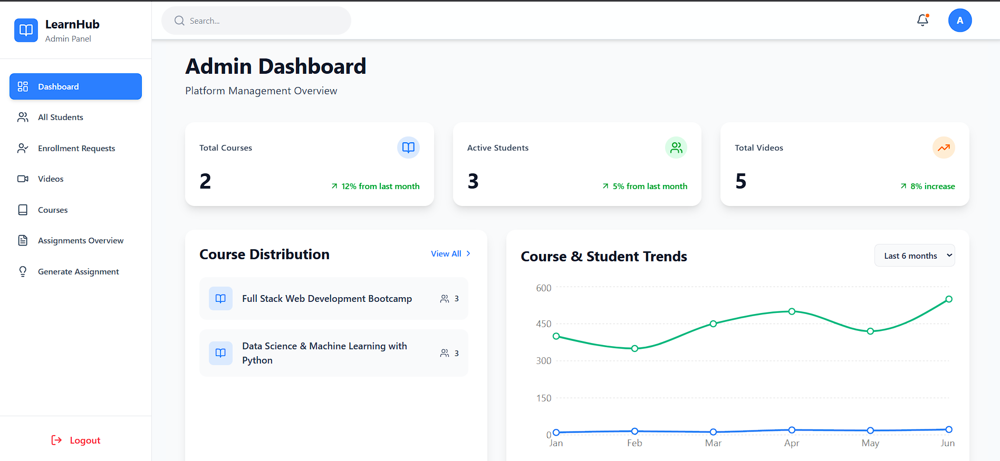
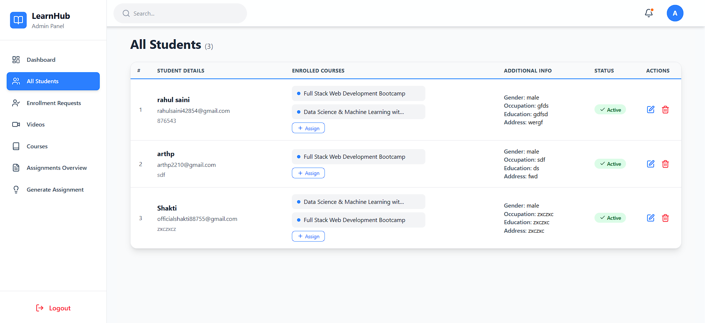
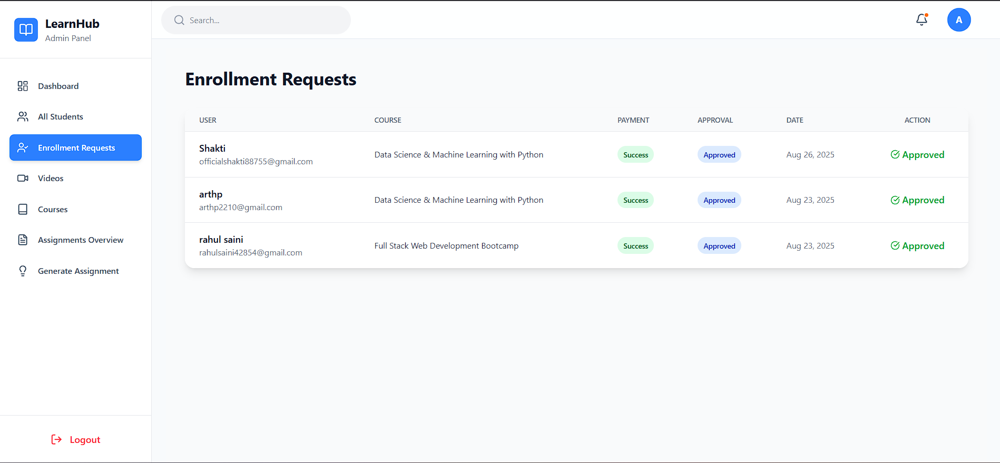
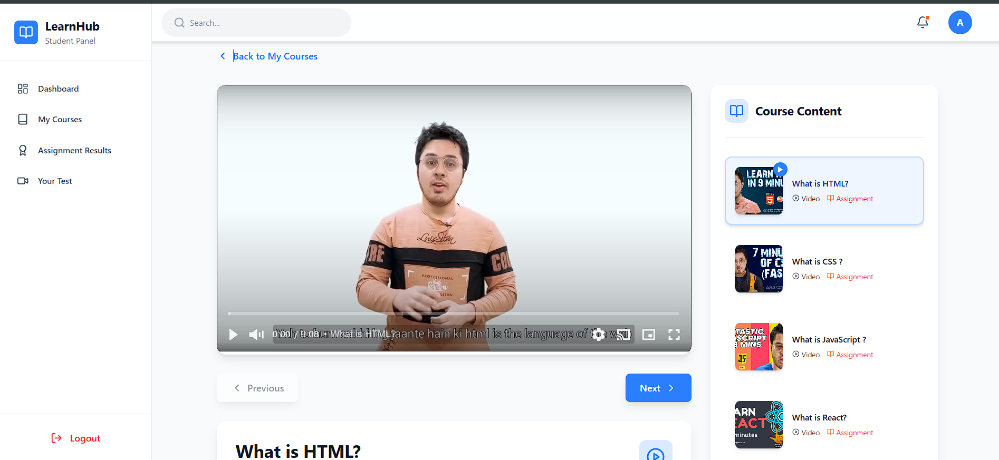
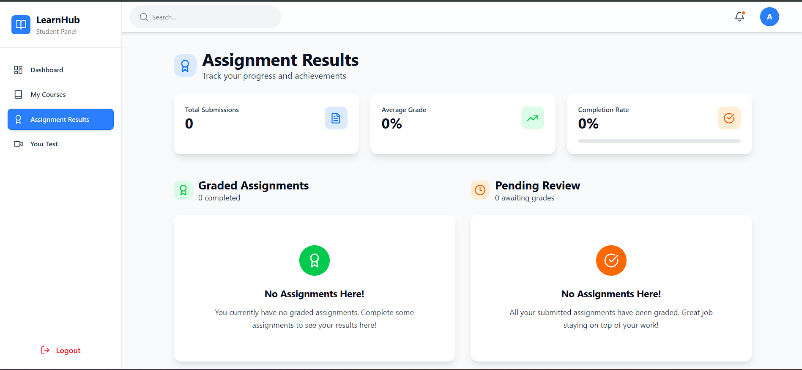

# 🎓 LearnHub: AI-Powered E-Learning Platform

<div align="center">


**🚀 Revolutionizing Education with Artificial Intelligence**

[](https://reactjs.org/)
[](https://nodejs.org/)
[](https://expressjs.com/)
[](https://mongodb.com/)
[](https://aws.amazon.com/s3/)

</div>

---

## ✨ Welcome to the Future of Learning

LearnHub is a **next-generation Learning Management System** that seamlessly blends cutting-edge AI technology with intuitive design. Built for educators, students, and institutions who demand excellence in digital learning experiences.

### 🌟 Why Choose LearnHub?

> **"Education is the most powerful weapon which you can use to change the world."** - Nelson Mandela

LearnHub empowers this change through intelligent, personalized, and secure learning environments.

---

## 🎯 Platform Overview

<table>
<tr>
<td width="50%">

### 👨‍💻 **Admin Portal**
- 🎛️ **Complete Control**: Comprehensive course management dashboard
- 📊 **Smart Analytics**: AI-driven insights and performance metrics
- 🤖 **AI Assistant**: Automated assignment generation with Google Gemini
- 💰 **Revenue Tracking**: Real-time financial analytics

</td>
<td width="50%">

### 👩‍🎓 **Student Portal**
- 🎥 **Secure Streaming**: Protected video content with progress tracking
- 📱 **Mobile First**: Responsive design for learning anywhere
- 🏆 **Gamification**: Badges, certificates, and achievement systems
- 🔐 **Fort Knox Security**: OTP verification and JWT authentication

</td>
</tr>
</table>

---

## 📈 Impressive Numbers

<div align="center">

| 🎓 Students | 📚 Courses | ⭐ Rating | ✅ Completion |
|-------------|------------|-----------|---------------|
| **10,000+** | **500+**   | **4.8/5** | **95%**      |
| *Active Learners* | *Available Now* | *User Satisfaction* | *Success Rate* |

</div>

---

## 🖼️ Visual Gallery

### 🏠 **Home & Dashboard Experience**

<table>
<tr>
<td align="center" width="50%">

<br><b>🏡 Welcoming Homepage</b>
</td>
<td align="center" width="50%">

<br><b>📊 Powerful Admin Dashboard</b>
</td>
</tr>
</table>

### 🤖 **AI-Powered Features**

<table>
<tr>
<td align="center" width="50%">

<br><b>🧠 AI Assignment Generator</b>
</td>
<td align="center" width="50%">

<br><b>📝 Smart Assignment Review</b>
</td>
</tr>
</table>

### 👥 **Student Management**

<table>
<tr>
<td align="center" width="33%">

<br><b>👥 Student Overview</b>
</td>
<td align="center" width="33%">

<br><b>📋 Enrollment Management</b>
</td>
<td align="center" width="33%">

<br><b>👤 Student Profiles</b>
</td>
</tr>
</table>

### 📚 **Learning Experience**

<table>
<tr>
<td align="center" width="50%">

<br><b>🎥 Interactive Learning</b>
</td>
<td align="center" width="50%">

<br><b>📋 Assignment Hub</b>
</td>
</tr>
</table>

---

## 🚀 Feature Highlights

### 🤖 **AI-Powered Intelligence**
- **🧠 Smart Recommendations**: Personalized course suggestions using machine learning
- **📝 Auto-Assignment Generation**: Google Gemini AI creates contextual questions and assessments
- **📊 Predictive Analytics**: Forecast student performance and identify at-risk learners
- **🎯 Adaptive Learning Paths**: Dynamic content adjustment based on student progress

### 🔒 **Enterprise-Grade Security**
- **🛡️ Multi-Layer Protection**: JWT authentication with role-based access control
- **📧 OTP Verification**: Secure email-based two-factor authentication
- **🎥 Content Protection**: Advanced video streaming with download prevention
- **💳 Secure Payments**: PCI-compliant transactions via Razorpay integration

### 📱 **Modern User Experience**
- **🎨 Beautiful UI/UX**: Clean, intuitive interface built with Tailwind CSS
- **📱 Mobile Responsive**: Seamless experience across all devices and screen sizes
- **⚡ Lightning Fast**: Optimized performance with lazy loading and caching
- **🌙 Dark/Light Modes**: Customizable themes for comfortable learning

### 📊 **Advanced Analytics**
- **📈 Real-time Dashboards**: Live enrollment trends and revenue tracking
- **🎯 Performance Metrics**: Detailed course completion and engagement analytics
- **📋 Custom Reports**: Generate insights for data-driven decision making
- **🔍 Student Insights**: Track individual progress and learning patterns

---

## 🛠️ Technology Stack

<div align="center">

### **Frontend Powerhouse**
[](https://reactjs.org/)
[](https://tailwindcss.com/)
[](https://reactrouter.com/)
[](https://axios-http.com/)
[](https://vidstack.io/)

### **Backend Excellence**
[](https://nodejs.org/)
[](https://expressjs.com/)
[](https://mongodb.com/)
[](https://mongoosejs.com/)
[](https://jwt.io/)

### **Cloud & Services**
[](https://aws.amazon.com/s3/)
[](https://ai.google/)
[](https://razorpay.com/)
[](https://nodemailer.com/)

</div>

---

## 🚀 Quick Start Guide

### 📋 **Prerequisites Checklist**

Before diving in, ensure you have:

- ✅ **Node.js** (v18 or higher) - [Download Here](https://nodejs.org/)
- ✅ **Package Manager** (npm or yarn)
- ✅ **MongoDB** (Local or Atlas) - [Get Started](https://mongodb.com/)
- ✅ **AWS Account** with S3 bucket - [Create Account](https://aws.amazon.com/)
- ✅ **Google AI Studio** API key - [Get API Key](https://ai.google.dev/)
- ✅ **Razorpay** merchant account - [Sign Up](https://razorpay.com/)

### 🔧 **Backend Setup**

```bash
# 1️⃣ Clone the repository
git clone https://github.com/Rahulsaini27/Elearning.git
cd backend

# 2️⃣ Install dependencies
npm install

# 3️⃣ Configure environment
cp .env.example .env
# Edit .env with your configuration

# 4️⃣ Launch the server
npm start
# 🎉 Backend running on http://localhost:5000
```

### 🎨 **Frontend Setup**

```bash
# 1️⃣ Navigate to frontend
cd frontend

# 2️⃣ Install dependencies  
npm install

# 3️⃣ Configure environment
cp .env.example .env
# Edit .env with your configuration

# 4️⃣ Start development server
npm run dev
# 🎉 Frontend running on http://localhost:5173
```

---

## 🧪 **Demo Access**

### 🎓 **Test Student Account**

<table>
<tr>
<td><b>📧 Email:</b></td>
<td><code>arthp2210@gmail.com</code></td>
</tr>
<tr>
<td><b>🔑 Password:</b></td>
<td><code>arthp2210@gmail.com</code></td>
</tr>
<tr>
<td><b>📚 Access:</b></td>
<td>Full Stack Web Development Bootcamp</td>
</tr>
</table>

> **💡 Pro Tip**: Use these credentials to explore all student portal features and experience the full learning journey!

---

## 🤝 Contributing to LearnHub

We believe in the power of community! Here's how you can be part of the LearnHub journey:

### 🌟 **Ways to Contribute**

<table>
<tr>
<td width="25%" align="center">
<h4>🐛 Bug Fixes</h4>
Help us squash bugs and improve stability
</td>
<td width="25%" align="center">
<h4>✨ New Features</h4>
Add exciting new functionality
</td>
<td width="25%" align="center">
<h4>📚 Documentation</h4>
Improve guides and tutorials
</td>
<td width="25%" align="center">
<h4>🎨 UI/UX</h4>
Enhance the user experience
</td>
</tr>
</table>

### 📝 **Contribution Process**

1. **🍴 Fork** the repository
2. **🌿 Create** your feature branch (`git checkout -b feature/AmazingFeature`)
3. **💾 Commit** your changes (`git commit -m 'Add some AmazingFeature'`)
4. **📤 Push** to the branch (`git push origin feature/AmazingFeature`)
5. **🔃 Open** a Pull Request

### 🐞 **Reporting Bugs**

When reporting bugs, please include:
- 📝 Clear problem description
- 🔄 Steps to reproduce
- ❓ Expected vs actual behavior
- 📸 Screenshots (if applicable)
- 💻 Environment details

---

## 📞 **Get in Touch**

<div align="center">

### 👨‍💻 **Developer**
**Rahul Saini**

[](https://github.com/Rahulsaini27)
[](https://linkedin.com/in/rahulsaini27)
[](mailto:rahulsaini27@gmail.com)

</div>

---

## 📄 **License**

This project is licensed under the **MIT License** - see the [LICENSE](LICENSE) file for details.

---

## 🙏 **Acknowledgments**

<div align="center">

**Special Thanks To:**
- 🌟 All contributors and the open-source community
- 🔧 Developers and maintainers of the technologies we use
- 💬 Users who provide valuable feedback and suggestions
- 🎓 Educators who inspire us to build better learning tools

</div>

---

<div align="center">

### 🚀 **Ready to Transform Education?**

[](#-quick-start-guide)
[](#-demo-access)
[](#-contributing-to-learnhub)

**⭐ Don't forget to star this repository if you found it helpful!**

</div>

---

<div align="center">
<sub>Built with ❤️ by <a href="https://github.com/Rahulsaini27">Rahul Saini</a> and the LearnHub community</sub>
</div>
